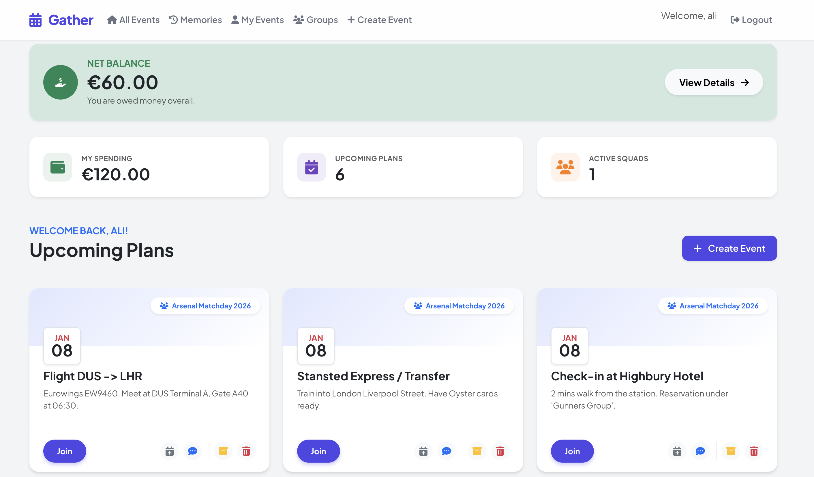
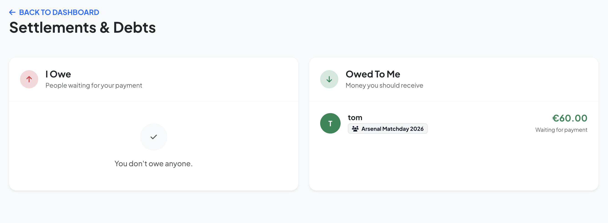
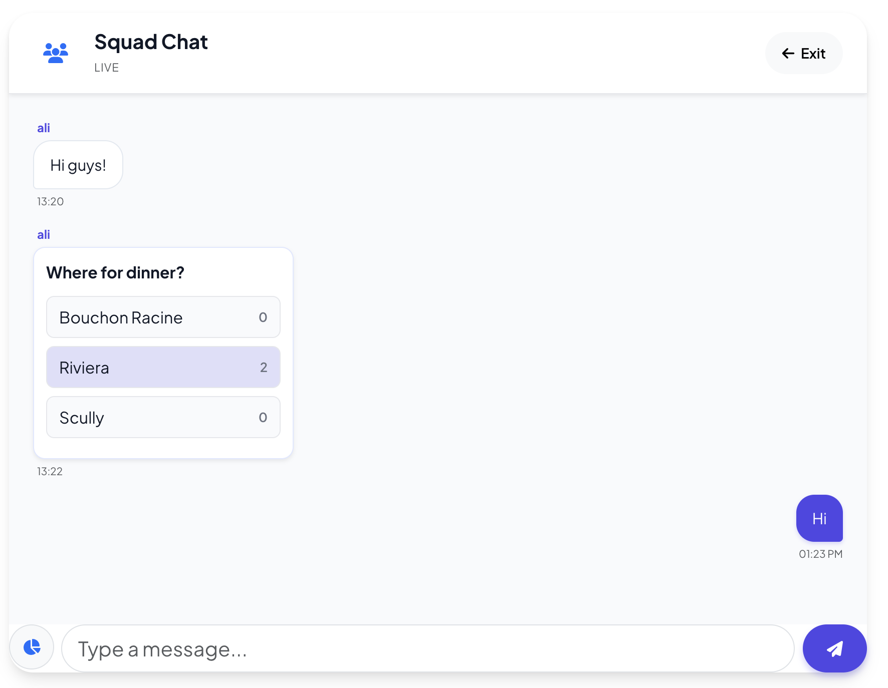

# Gather – Social Event & Trip Planner

🔗 **Live Demo**
Access the app here: [https://gather-xrz0.onrender.com](https://gather-xrz0.onrender.com)

> **Note:** Hosted on Render's free tier. The server may take a few minutes to wake up if inactive.

---

Gather is a Spring Boot web application that helps groups plan trips and events together, with a strong focus on **shared expenses and debt splitting (Splitwise-like functionality)**.

It allows friends or travel groups to not only organize events, but also **track who paid what, calculate balances automatically, and settle debts transparently**, all in one platform.

---

## ✨ Key Features

### 📅 Events & Planning
Create and manage group events, registrations, and schedules with a central dashboard overview.



---

### 💸 Shared Expenses (Splitwise-like)
Track shared expenses per group, automatically split costs, and maintain a transparent shared wallet.

- Automatic expense splitting
- Group spending overview
- Per-user balances



---

### ⚖️ Debt Calculation & Settlement
Automatically calculated debts and global balances, showing who owes whom across groups.

- Debts you need to pay
- Debts owed to you
- Manual settlement tracking


---

### 💬 Real-Time Chat & Polls
Real-time group communication for coordination and decision making.

- WebSocket-based group chat (STOMP)
- Polls for quick group decisions
- Live vote updates



---

### 👤 Authentication, Groups & Security
Secure access and group management.

- User registration with email verification
- JWT-based authentication
- Group creation, admin roles, and invite links
- Route protection via Spring Security

---

##  Architecture Overview

* **Backend**: Spring Boot (MVC + REST)
* **Security**: Spring Security, JWT
* **Persistence**: Spring Data JPA, Hibernate
* **Database**: H2 (dev) / configurable for production
* **Views**: Thymeleaf
* **Real-time**: WebSockets (STOMP)
* **Async Tasks**: Spring `@EnableAsync`

---

##  Main Modules

* `auth` – registration, login, verification, JWT
* `groups` – group lifecycle and membership
* `events` – event management & calendar export
* `chat` – real-time messaging and polls
* `expenses` – shared costs and totals
* `debts` – balance calculation and settlement

Each module exposes:

* MVC controllers (web UI)
* REST controllers (API)
* Service layer (business logic)
* Repository layer (JPA)

---

##  REST API Overview (Examples)

### Authentication

* `POST /api/auth/register`
* `POST /api/auth/login`
* `POST /api/auth/verify`

### Groups

* `GET /api/groups`
* `POST /api/groups`
* `POST /api/groups/{groupId}/members`

### Events

* `GET /api/events`
* `POST /api/events/new?groupId=1`
* `POST /api/events/register/{eventId}`
* `POST /api/events/unregister/{eventId}`

### Expenses

* `GET /api/groups/{groupId}/expenses`
* `GET /api/groups/{groupId}/expenses/total`
* `POST /api/groups/{groupId}/expenses`

> All API endpoints (except auth) require a valid JWT token.

---

##  Demo Data

By default, the application seeds demo data on startup:

* Users: `ali / 1234`, `tom / 1234`
* Example group and events

You can disable seeding in production:

```properties
app.db.seed=false
```

---

##  Running the Project Locally

### Prerequisites

* Java 17+
* Maven

### Run

```bash
mvn spring-boot:run
```

App will be available at:

```
http://localhost:8080
```

---


## 🛠️ Technologies Used

* Java 17
* Spring Boot
* Spring Security
* Spring Data JPA
* Hibernate
* WebSockets (STOMP, SockJS)
* JWT
* Thymeleaf
* Maven

---

##  Project Status

The project is actively evolving and designed to be extended with additional features and integrations.

###  Planned Features / Roadmap

* [ ] **Profile Pictures**: Allow users to upload and manage custom profile pictures.
* [ ] **Location Sharing**: Ability to send map pins or current location in group chat.
* [ ] **Push Notifications**: Web push notifications for new chat messages
* [ ] **Recurring Events**: Support for weekly and monthly meetups
* [ ] **Advanced Expense Splitting**: Split expenses by percentage or shares (currently even split)

